# 正则调试工具

对于：

* 写正则：把想要的规则用正则语法写出来
* 看别人的正则：看懂已有正则的含义

期间，可以借助于一些好用的工具，更好的实现自己的目的。

## 正则可视化

### jex.im

新发现一个网站，可视化效果更好：

* 网站：[Regulex：JavaScript Regular Expression Visualizer](https://jex.im/regulex/)
  * 特点：
    * 可视化效果好看
    * 支持更多选项
  * 举例
    * `&name=CrifanLi(?=&language=[a-zA-Z]+)`
      * 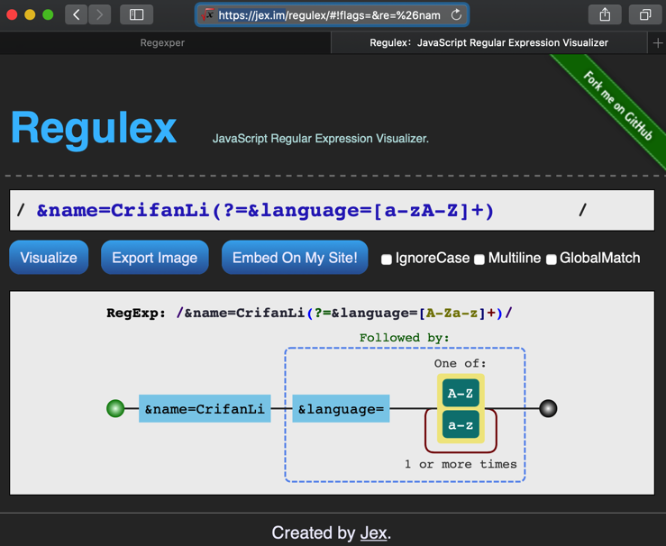
    * `^[^\r\n]+href="(\w+\.mp3)"[^\r\n]+$`
      * 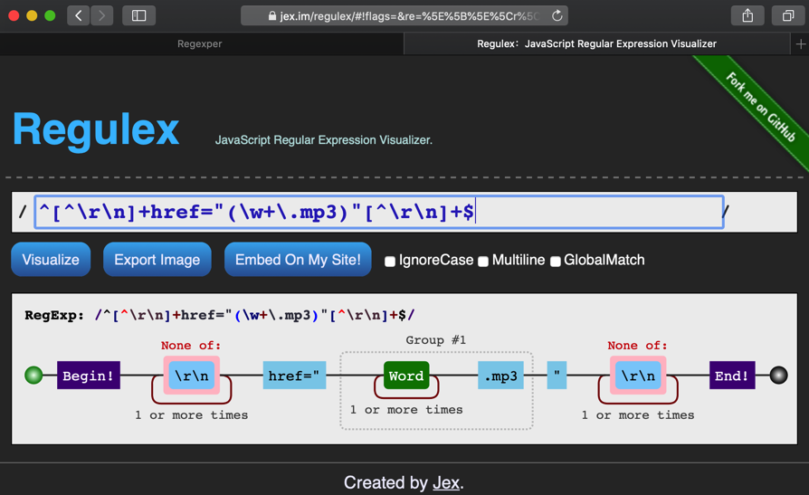

### regexper.com

* 网站：https://regexper.com
  * 特点：
    * 可以把正则表达式，很好的可视化，便于人们理解其内部逻辑和含义
    * 能识别高级语法，如`look ahead`
  * 效果：
    * `&name=CrifanLi(?=&language=[a-zA-Z]+)`
      * 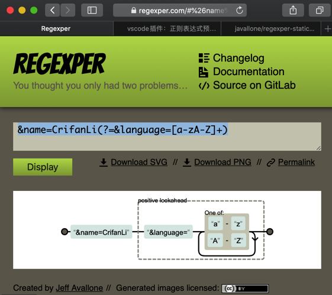
    * `^[^\r\n]+href="(\w+\.mp3)"[^\r\n]+$`
      * 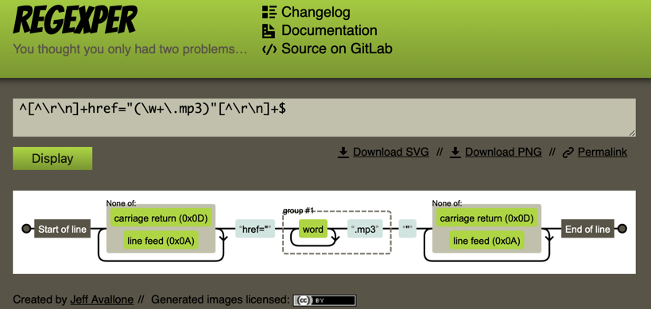
* VSCode的插件：`regexper-static`
  * 效果：插件官方gif动图
    * 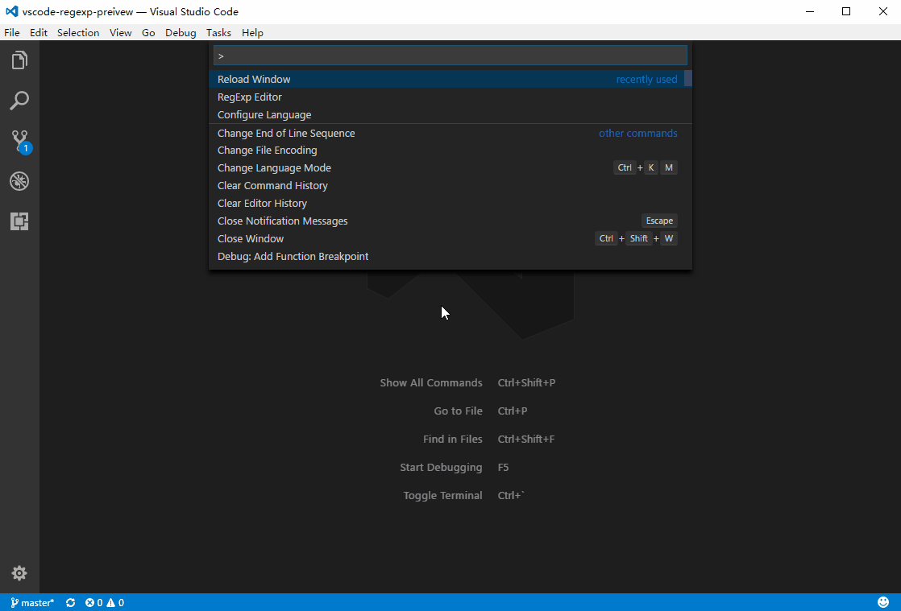
  * 安装：
    * 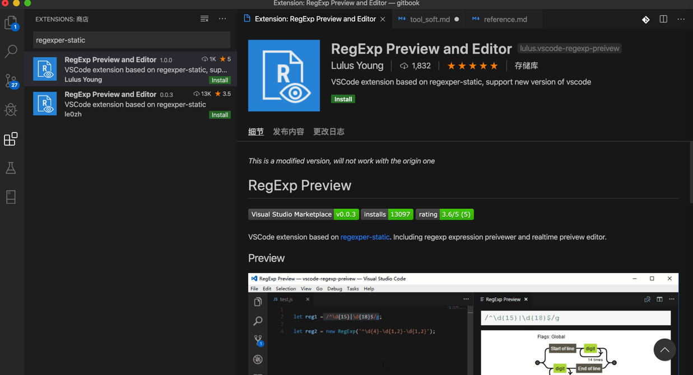
  * 使用：
    * 选中要可视化的正则表达式字符串->右击->`RegExp Preview`
      * 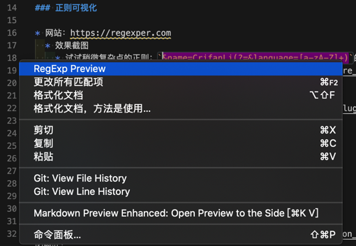
  * 效果：
    * 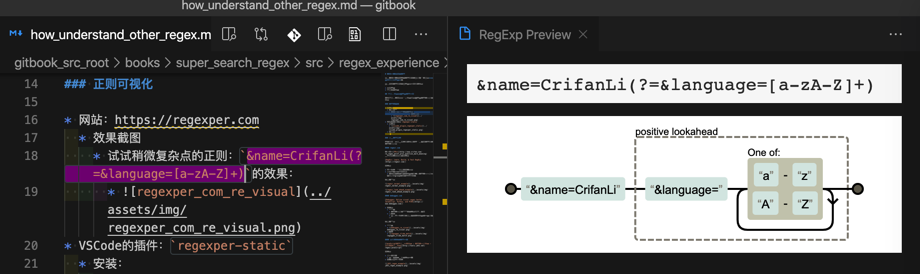

## 在线正则调试网站

另外，有几个在线网站，可以用来学习和理解正则，调试正则表达式：

### regexr.com

之前折腾[这个](http://www.crifan.com/re_regex_point_plus_question_mark_meaning)期间，发现个好用的网站：

[RegExr: Learn, Build, & Test RegEx](https://regexr.com/)

优点：

* 匹配内容鼠标移动可高亮显示
* 每个字符精确含义解释
  * 可以结构化的，层次清晰的，列出正则表达中每个字符，每个group组等的详细含义。

效果如图：

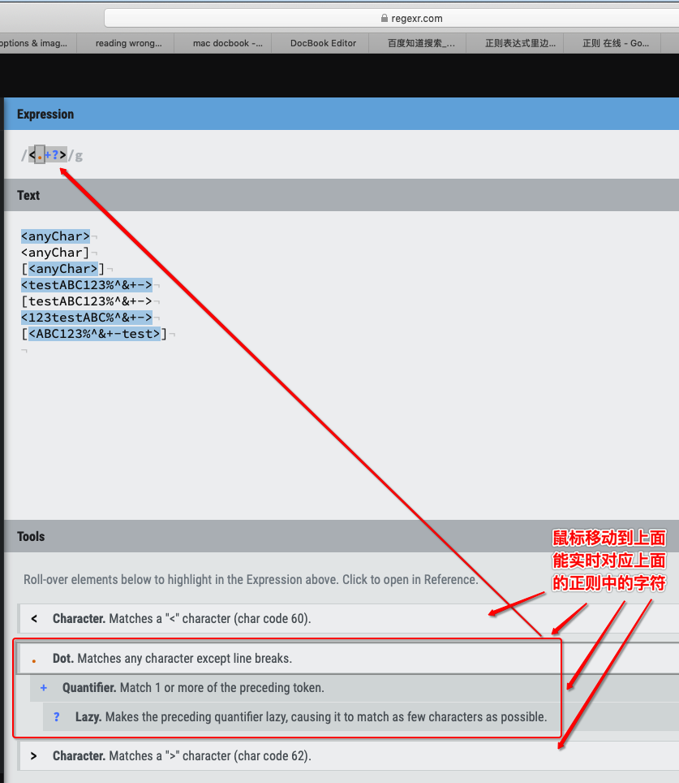

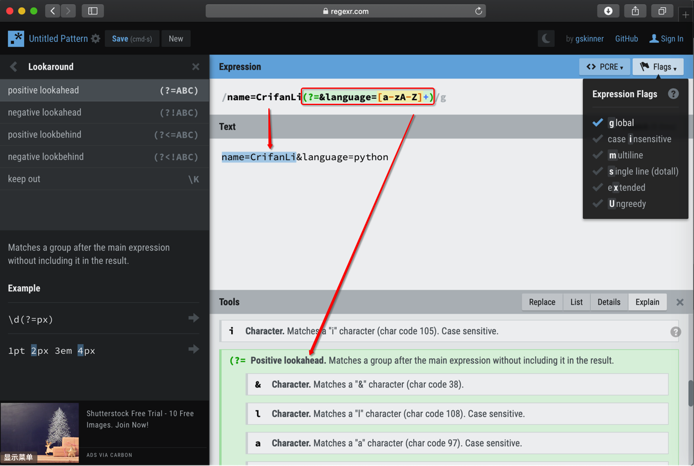

### debuggex.com

[Debuggex: Online visual regex tester. JavaScript, Python, and PCRE](https://www.debuggex.com/)

* 优点：
  * 图形化
    * 正则表达式的图形化的表示，便于理解
  * 进度条
    * 对于匹配内容，拖动进度条可以清晰的看到是否匹配

效果如图：

* 图形化
  * 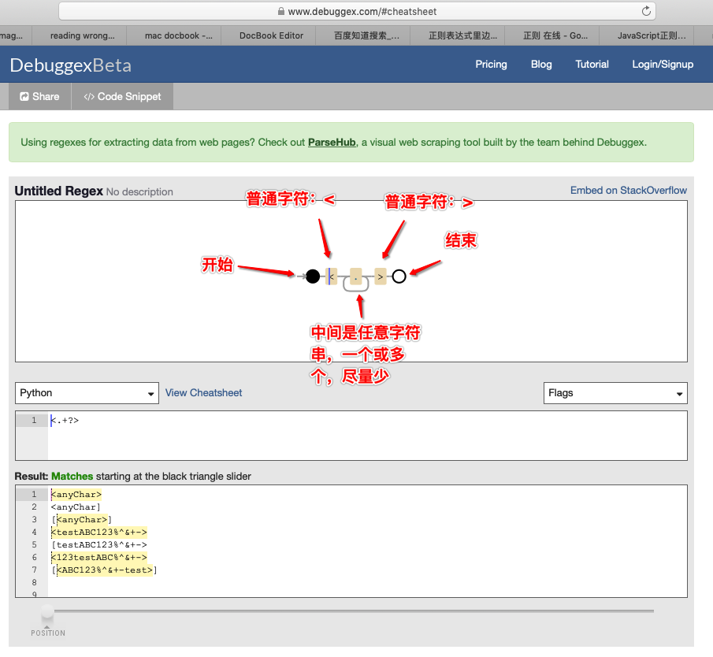
* 进度条
  * 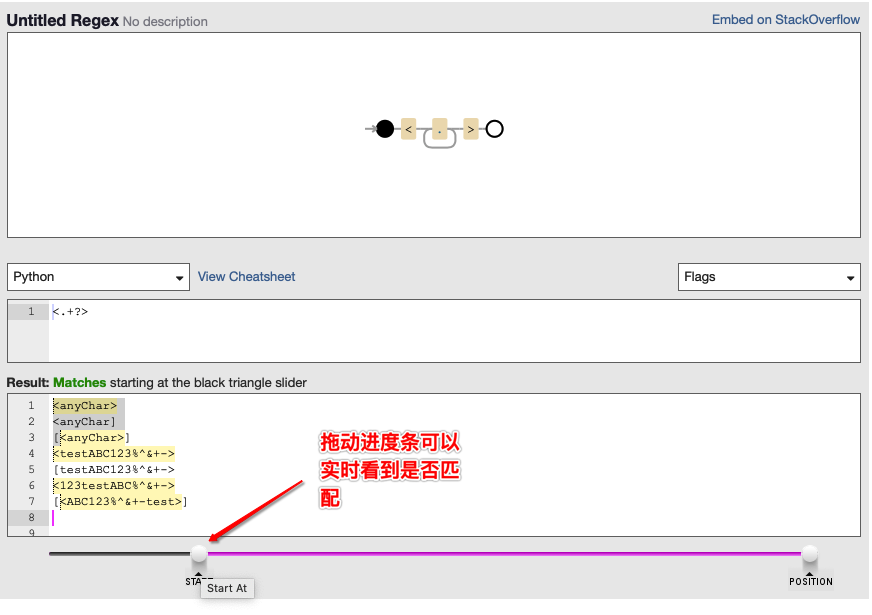

### 脚本之家的正则测试

[JavaScript正则在线测试工具 - 正则表达式工具 - 脚本之家在线工具](http://tools.jb51.net/regex/javascript)

优点：

* 是中文网站
  * 对于英文不熟悉的容易看懂
* 高亮显示匹配内容

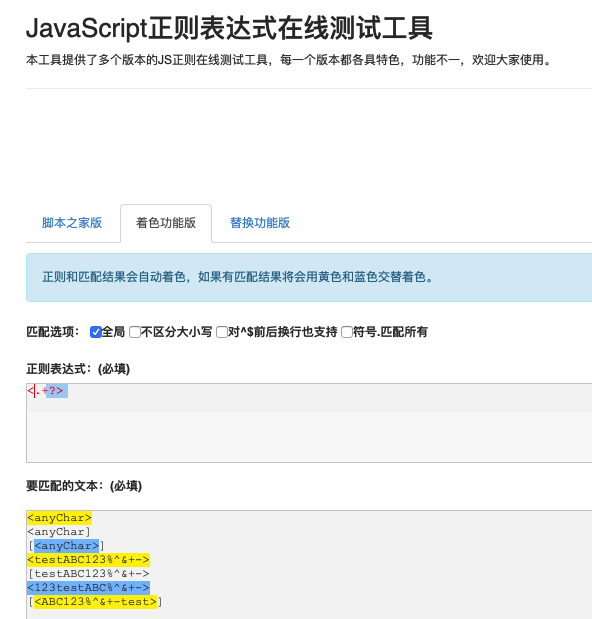
