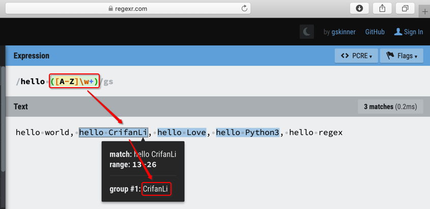

# 正则这个词是什么意思

先来说说：

* 正则这个词是什么意思

或者说：

* 正则 这个名称是什么意思？
* 正则 这个名字是怎么来的？
* 为何叫做正则？

先解释名词本身的称谓：

* `正则`
  * 中文
    * 全称：`正则表达式`
  * 英文
    * 全称：`regular expression`
    * 简称
      * `re`
        * 来自：**RE**`gular expression`
      * `regex`
        * 来自：**REG**`ular` **EX**`pression`

再来解释：正则的词的含义

首先要明白，正则主要存在的领域：字符串

在字符串的领域，即处理字符串相关内容时，往往会遇到搜索（和替换）

而对于普通字符串，比如：

> asdlkg77832qth4uht

是不是你看起来，觉得，没什么特殊规律？

是的，我也看不出有什么规律。

所以，可称之为：**普通字符串**

而对于：

> hello world, hello CrifanLi, hello Love, hello Python3, hello regex

是不是觉得有**规律**可循？

且如果要从其中找出：hello xxx中的xxx，且如果再加上限定条件：xxx首字母是大写

你是不是也能一眼看出其中的规律?

很明显，是的：除了第一个和最后一个，中间的3个，都符合条件

换句话说：这个字符串，有一定**规律**，有规律可循

再来说regular这个英文单词，其本意就是：**有规律的**，整齐的，（形状）**规则的**

如此，就容易理解：

`regular expression`=`正则表达式`

就是指：

* 要处理的字符串是有规律的，有规律可循的
  * 而 正则表达式 = （用特定语法写出来的）字符串的规律

进步一说，要从上述字符串中，提取出：

* `hello xxx`中的`xxx`
  * 且再加上限定条件：`xxx`中的首字母是大写

对应的正则就是：

`hello ([A-Z][a-zA-Z0-9]+)` 或： `hello ([A-Z]\w+)`

从[RegExr: Learn, Build, & Test RegEx](https://regexr.com)，可见匹配效果，如图：

汇总如下：

* `普通字符串`：可视为**没有规律**的
  * 比如：`asdlkg77832qth4uht`
* `有规律的字符串`：是我们要处理的，即搜索或替换等操作
  * 我们才去把**字符串中的规律**，用`正则表达式`去写出来
    * 从而匹配到我们要的字符串
      * 用于后续的其他操作
  * 比如：
    * 有规律的字符串：`hello world, hello CrifanLi, hello Love, hello Python3, hello regex`
      * 想要匹配和提取：`hello Xxx`中的`Xxx`，且`Xxx`的首字母是大写
      * 对应正则表达式：`hello ([A-Z][a-zA-Z0-9]+)`
        * 或 `hello ([A-Z]\w+)`

## 正则这个词的含义

总结起来就是：

* `regular`=`正则`：**有规律的**
  * 字符串中要处理的内容是**有规律的**
* `regular expression`=`正则表达式`：用**正则的语法**把**字符串的规律**表达出来
  * 目的：实现**字符串的处理**，如**搜索**出匹配的值，字符串的成其他值等
