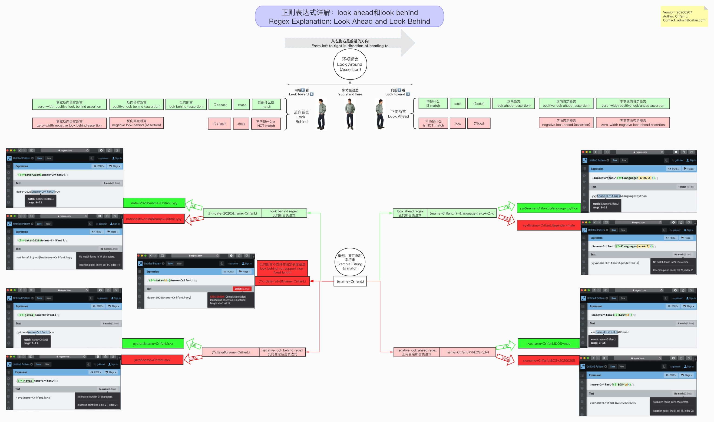
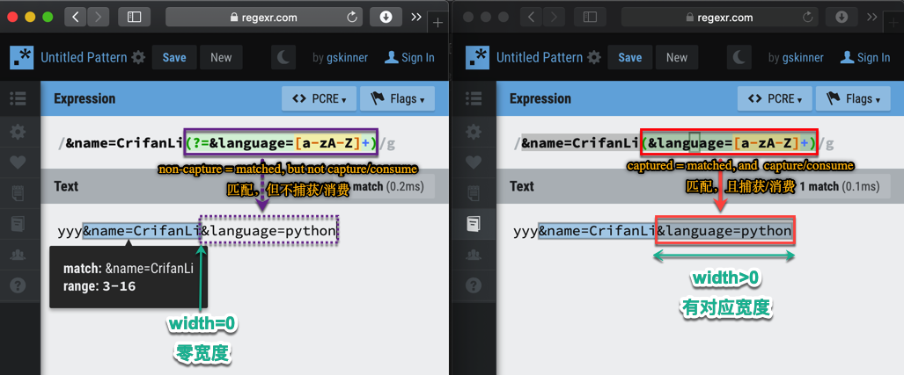

# 环视断言Look Around

正则中，有一部分的语法叫做：`Look Around`，下面详细解释如下：

* 在线浏览
  * [正则表达式详解：look ahead和look behind](https://www.processon.com/view/link/5e3a5bdbe4b06b291a60f195)
* 如图
  * 

下面再详细解释如下：

## 断言

* 叫法
  * 英文：`assertion`
  * 中文：`断言`
* 含义：声称，判断，预言： 是 或 否=不是
  * 是：
    * 是什么（样的）
  * 不是
    * 不是什么（样的）
* 正则表达中的 断言
  * 叫法：
    * 是 -》 匹配
    * 不是 -》 不匹配
  * 含义
    * 广义：所有的正则表达式都是断言
      * 都是 匹配 或 不匹配 对应规则
    * 狭义：往往指的是 零宽断言

## 零宽断言

* `zero-width assertion`=`零宽度断言`=`零宽断言`
  * =`zero-length assertion`=`零长度断言`
  * 包括
    * **word** level 单词级别
      * `\b`
      * `\B`
    * **single** line level 单行级别
      * `^`
      * `$`
    * **multiple** line 多行=whole string 整个字符串=whole document 整篇文档级别 level
      * `\A`
      * `\Z`
    * `look around` (assertion)=`环视断言`
      * 包括
        * `positive look ahead`=`look ahead`
        * `negative look ahead`
        * `positive look behind`=`look behind`
        * `negative look behind`
      * -》
        * `zero-width positive look ahead assertion`
        * `zero-width negative look ahead assertion`
        * `zero-width positive look behind assertion`
        * `zero-width negative look behind assertion`

## 非捕获匹配

* non-capture match=非捕获匹配
  * 正则语法：(?:pattern)
  * 含义：
    * 去匹配match，但是不捕获capture，不消费consume 对应的字符串

-> 某种程度上说，此处的`look around`，也算是属于**非捕获匹配**

## 环视断言look around

* `look around`：属于`zero-width assertion`
* 含义
  * 概述：`look around`=`环视断言`
    * 包含
      * `(?=xxx)`: `(positive) look ahead (assertion)`=`正向肯定断言`
      * `(?!xxx)`: `negative look ahead (assertion)`=`正向否定断言`
      * `(?<=xxx)`: `(positive) look behind (assertion)`=`反向肯定断言`
      * `(?<!xxx)`: `negative look behind (assertion)`=`反向否定断言`
    * -> 加上`零宽`前缀
      * `zero-width positive look ahead assertion`=`零宽正向肯定断言`
      * `zero-width negative look ahead assertion`=`零宽正向否定断言`
      * `zero-width positive look behind assertion`=`零宽反向肯定断言`
      * `zero-width negative look behind assertion`=`零宽反向否定断言`
  * 详解
    * `look around`=`环视断言`
      * `look ahead`
        * 英文：
          * `positive look ahead`
          * `look ahead`
          * `zero-width positive look ahead assertion`
        * 中文：
          * 一般译为：`零宽正向先行断言`
          * 其他叫法：
            * (正向)前瞻性断言
            * (正向)超前断言
            * 正向预查
            * 零宽断言
          * 最佳翻译：
            * `正向肯定查找`
            * `正向肯定断言`
      * `negative look ahead`
        * 英文：
          * `negative look ahead`
          * `zero-width negative look ahead assertion`
        * 中文：
          * 一般译为：`零宽负向先行断言`
          * 其他叫法：
            * 负向先行断言
            * 否定超前断言
          * 最佳翻译：
            * `正向否定查找`
            * `正向否定断言`
      * `look behind`
        * 英文：
          * `positive look behind`
          * `look behind`
          * `zero-width positive look behind assertion`
        * 中文：
          * 一般译为：
            * (正向)后行断言
            * (正向)后顾断言
            * `零宽正向后行断言`
            * `正回顾后发断言`
            * `零宽正回顾后发断言`
          * 最佳翻译：
            * `反向肯定查找`
            * `反向肯定断言`
      * `negative look behind`
        * 英文：
          * `negative look behind`
          * `zero-width negative look behind assertion`
        * 中文：
          * 一般译为：
            * 负向后行断言
            * `零宽负向后行断言`
            * 负回顾后发断言
            * `零宽负回顾后发断言`
          * 最佳翻译：
            * `反向否定查找`
            * `反向否定断言`

### 零宽度+非捕获 vs 普通有宽度+捕获

用下图来对比说明：

