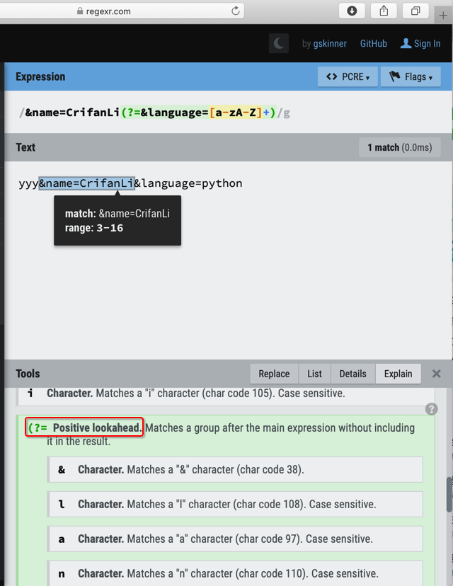
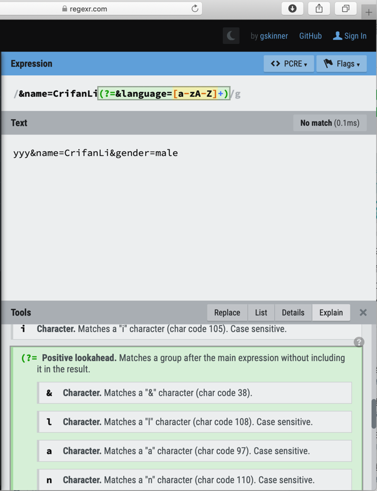
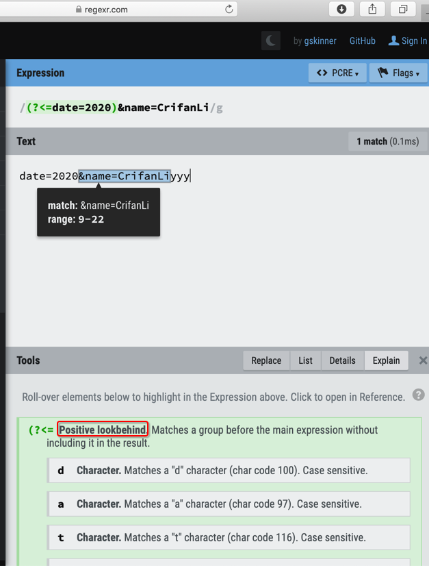
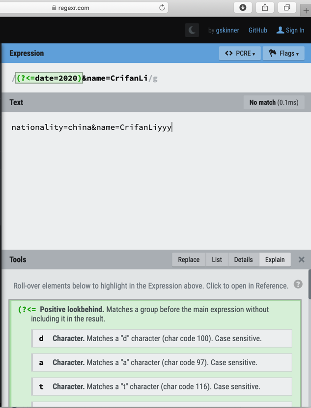
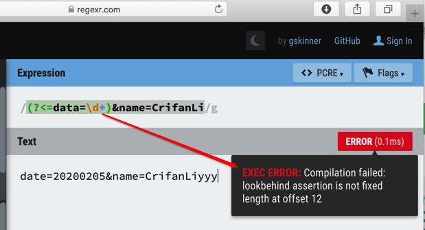
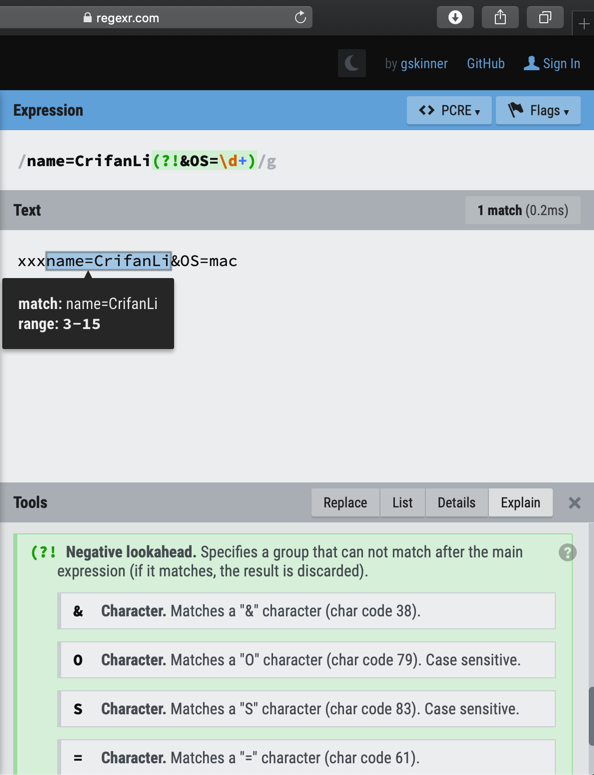
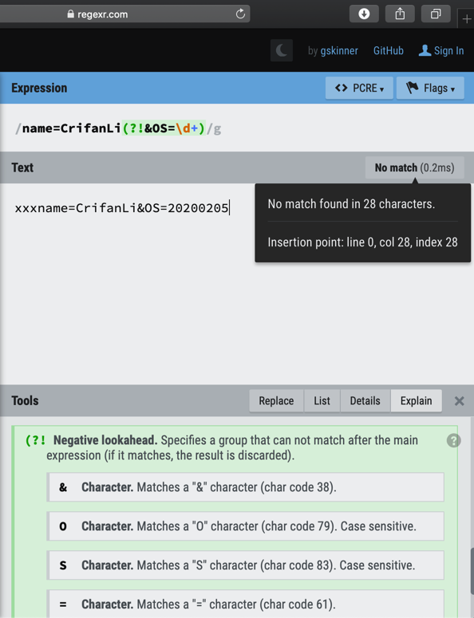
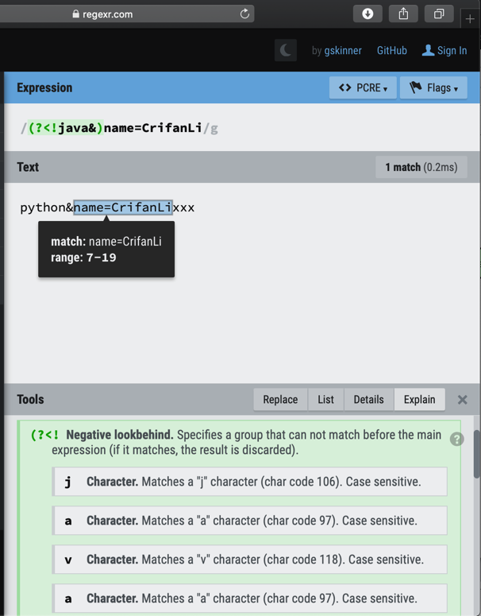
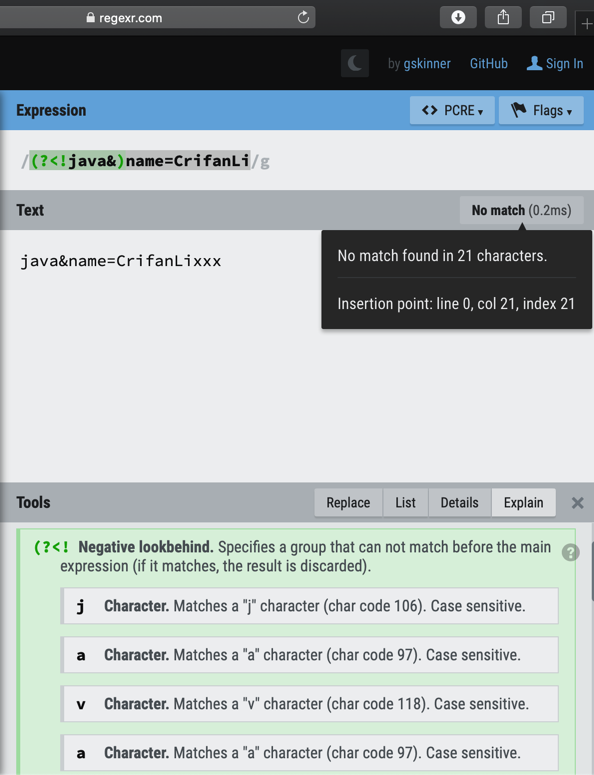

# 举例解释

如前面概述`look around`包含：

* `positive lookahead assertion`：`(?=xxx)`
* `negative lookahead assertion`：`(?!xxx)`
* `positive lookbehind assertion`：`(?<=xxx)`
* `negative lookbehind assertion`：`(?<!xxx)`

用图解释：

举例来说明：

* 需求：
  * 要匹配的，普通的，字符串：`&name=CrifanLi`
    * 进一步要求：匹配的字符的 前面 或 后面 也有些其他，符合特定的规则的，字符才匹配，否则不匹配
      * 举例：
        * 后面也有字符，且是&language=xxx，其中xxx是字母，才匹配，否则不匹配
          * 比如：
            * 匹配：`yyy&name=CrifanLi&language=python`
            * 不匹配：`yyy&name=CrifanLi&gender=male`
        * 前面也有些字符，且是date=2020，才匹配，否则不匹配
          * 比如：
            * 匹配：`date=2020&name=CrifanLiyyy`
            * 不匹配：`nationality=china&name=CrifanLiyyy`
        * 后面不能出现也有些字符，比如&OS=xxx，其中xxx是数字，才匹配，否则不匹配
          * 比如
            * 匹配：`xxxname=CrifanLi&OS=mac`
            * 不匹配：`xxxname=CrifanLi&OS=20200205`
        * 前面不能出现某些字符，比如java&，才匹配，否则不匹配
          * 比如
            * 匹配：`python&name=CrifanLixxx`
            * 不匹配：`java&name=CrifanLixxx`
  * 背景知识：相对于，当前要匹配的字符串，从左向右 的方向属于 前进的方向
    * `后面`=`向前看`=`向右看`=`向⬅️看`=`look ahead`
    * `前面`=`向后看`=`向左看`=`向⬅️看`=`look behind`
    * 用图举例
      *  `&name=CrifanLi` 
      *  你站在  这里 
  * 将上述需求，转换成正则表达式
    * `&name=CrifanLi(?=&language=[a-zA-Z]+)`
      * 匹配：`yyy&name=CrifanLi&language=python`
        * 
      * 不匹配：`yyy&name=CrifanLi&gender=male`
        * 
    * `(?<=date=2020)&name=CrifanLi`
      * 匹配：`date=2020&name=CrifanLiyyy`
        * 
      * 不匹配：`nationality=china&name=CrifanLiyyy`
        * 
      * 注意：向后看look behind，只支持 固定长度fixed length的内容的匹配
        * 不支持这种 data=\d+ 的不固定的写法，否则会报错：
          * 
    * `name=CrifanLi(?!&OS=\d+)`
      * 匹配：`xxxname=CrifanLi&OS=mac`
        * 
      * 不匹配：`xxxname=CrifanLi&OS=20200205`
        * 
    * `(?<!java&)name=CrifanLi`
      * 匹配：`python&name=CrifanLixxx`
        * 
      * 不匹配：`java&name=CrifanLixxx`
        * 
